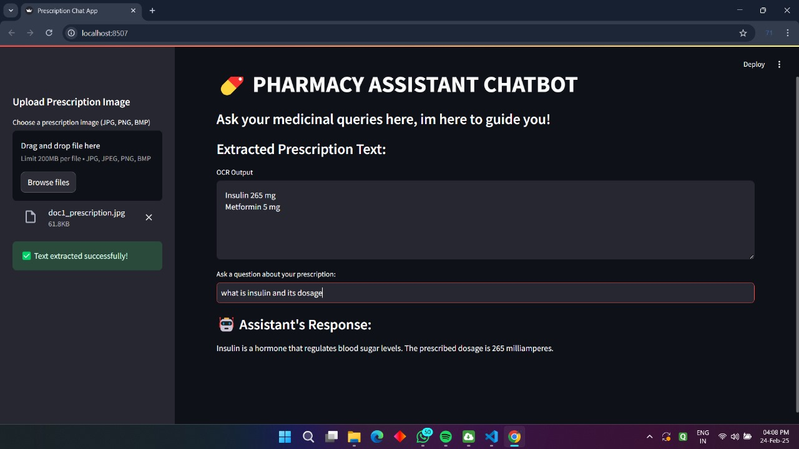
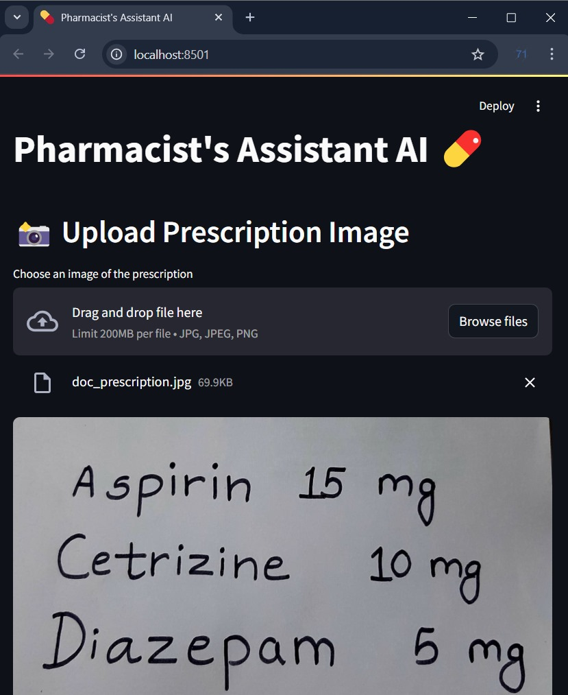

# MediSense AI - Pharmacist Assistant 💊

MediSense AI is your smart pharmacy companion, making it easy to process handwritten prescriptions. It extracts medicine names using OCR, matches them with pharmacy inventory using fuzzy logic, and generates accurate final orders with quantity and price validation. Plus, patients can interact with an AI-powered chatbot to get quick answers about their medications.

---

## 🖼️ Project Screenshots
- **Main Application Interface:** 
- **Prescription Upload:** 

---
## 🚀 Features
- Upload handwritten prescription images (JPG, PNG, BMP)
- Extract prescription text using PyTesseract
- Match medicines using fuzzy logic (FuzzyWuzzy)
- Validate stock quantities and calculate total prices
- Chatbot powered by Google Gemini AI

---

## 📋 Prerequisites
1. **Install Python**: [Download Python](https://www.python.org/downloads/) (Recommended: Python 3.11)
2. **Install Tesseract**: [Download Tesseract OCR](https://github.com/tesseract-ocr/tesseract)
   - Set the path in your code:
   ```python
   pytesseract.pytesseract.tesseract_cmd = r'C:\Program Files\\Tesseract-OCR\\tesseract.exe'
   ```

---

## 💾 Installation
1. **Clone the repository**
```bash
git clone https://github.com/radhaswaman/MediSense-AI.git
cd MediSense-AI
```

2. **Create a Virtual Environment**
```bash
# For Windows
python -m venv venv
venv\\Scripts\\activate

# For MacOS/Linux
python3 -m venv venv
source venv/bin/activate
```

3. **Install Required Libraries**
```bash
pip install -r requirements.txt
```

---

## 🔑 Google Gemini API Key Setup
1. Go to [Google AI Studio](https://ai.google.dev/)
2. Generate your API key.
3. Add the key to your environment variables:
```python
import os
os.environ["GOOGLE_API_KEY"] = "YOUR_API_KEY"
```

---

## 🟢 Running the Application in VS Code
1. **Activate Virtual Environment**
```bash
# Windows
venv\\Scripts\\activate

# MacOS/Linux
source venv/bin/activate
```
2. **Start Streamlit App**
```bash
streamlit run pharmacy_assistant.py
```
3. Open the local server link in your browser (e.g., `http://localhost:8501`)

---

## 🗂 File Structure
```plaintext
MediSense-AI
├── pharmacy_assistant.py  # Main application file
├── chatbot.py             # Chatbot functionality file
├── pharmacy_db.csv        # CSV file containing medicine inventory
├── requirements.txt       # Required libraries
├── doc_prescription.jpg   # Sample prescription to upload
├── doc1_prescription.jpg  # Sample prescription to upload
└── README.md              # Documentation
```

---

## 💡 Usage Instructions
1. Upload a prescription image using the sidebar.
2. Extracted text will be displayed.
3. Adjust medicine quantities if required.
4. View the final order in JSON format.

---

## 🤖 AI Chatbot Functionality
- Enter a query about your prescription.
- Gemini AI will analyze the JSON and provide a response.

---

## ✅ Troubleshooting
- **Tesseract not found:** Ensure Tesseract is correctly installed and path is set.
- **Google API error:** Verify that the API key is valid and added to environment variables.
